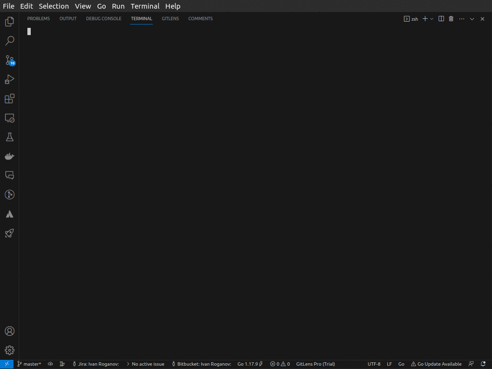

# GoGPT: Command Line Interface for OpenAI's GPT



GoGPT is a command-line interface for OpenAI's powerful GPT models. Write text, get smart replies, all from the comfort of your terminal. This program allows you to interact with GPT models easily, whether it's for a quick question, generating text, or integrating into your command-line workflow.

## Features

- Simple and intuitive CLI
- Supports all available GPT models
- Interactive configuration setup
- Command line input and output
- Conveyor (`|`) and Redirection (`>`) friendly
- Loading spinner to visualize request process
- Read and Write from text files

## Installation

1. Clone the repository:

    ```
    git clone https://github.com/nurked/gogpt.git
    ```

2. Go to the project directory:

    ```
    cd gogpt
    ```

3. Build the project:

    ```
    go build
    ```

4. The `gogpt` binary is ready to use.

5. Install it system-wide:

    ```
    go install
    ```

## Usage

To start using GoGPT, you'll first need to configure it with your OpenAI API key. 

```bash
./gogpt --configure
```

Just follow the interactive prompts. Once configured, you can start interacting with GPT directly:

```bash
./gogpt "Tell me a joke about humans"
```

Or, send in a text file:

```bash
cat request.txt | ./gogpt
```

## Choose a Different GPT Model

To use a different GPT model, just pass the `--model` flag:

```bash
./gogpt --model
```

You will be presented with a list of available models to choose from.

## Contribute

Contributions are welcome! Feel free to submit a pull request.

## License

MIT

## More

Want more like this? Watch this space. More exciting projects coming soon. 

---

Take your terminal interactions to the next level with GoGPT.
